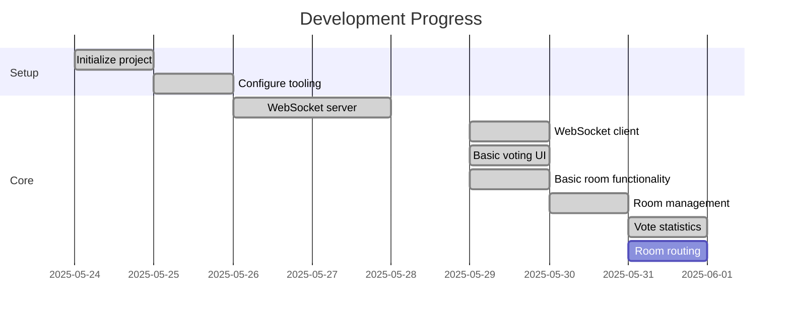

# Active Context

## Current Focus
- Polish room creation/joining forms

## Next Implementation Steps

1. **Room Management**
   - Add form validation
   - Implement room leave functionality

2. **WebSocket Enhancements**
   - Implement automatic reconnection
   - Add connection status indicators
   - Handle connection errors gracefully

3. **Voting Interface**
   - Room management UI polish
   - Add vote submission feedback

3. **Completed Tasks**

## Key Updates
- WebSocket server implemented using Node.js and Socket.IO
- Single 'room-updated' event pattern adopted
- Server running on port 3001 with CORS configured

## Key Decisions
1. Using pnpm for faster dependencies
2. Separate ports for Next.js (3000) and Socket.IO (3001)
3. UUID generation on server for better consistency

## Open Questions
- Should we implement server-side validation for vote values?
- Need to decide on reconnect policy for WebSocket
