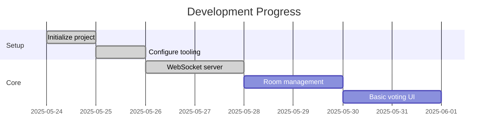

# Active Context

## Current Focus
Implementing client-side WebSocket integration and voting interface.

## Next Implementation Steps
1. **WebSocket Integration**
   - Create Socket.IO client wrapper
   - Implement Zustand store for room state
   - Handle connection events

2. **Core Features**
   - Voting card components
   - Participant list display
   - Moderator controls

3. **Completed Tasks**

## Key Updates
- WebSocket server implemented using Node.js and Socket.IO
- Single 'room-updated' event pattern adopted
- Server running on port 3001 with CORS configured

## Key Decisions
1. Using pnpm for faster dependencies
2. Separate ports for Next.js (3000) and Socket.IO (3001)
3. UUID generation on server for better consistency

## Open Questions
- Should we implement server-side validation for vote values?
- Need to decide on reconnect policy for WebSocket
