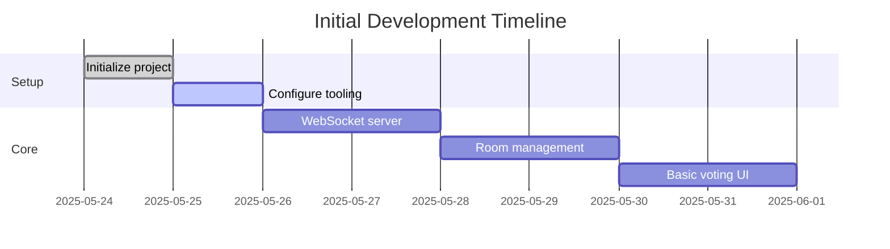

# Active Context

## Current Focus
Initializing the project structure and implementing core WebSocket functionality.

## Next Implementation Steps
1. **Project Setup**
   - Initialize Next.js app with TypeScript
   - Configure pnpm workspace
   - Set up Socket.IO server

2. **Core Features**
   - Room creation/joining endpoints
   - WebSocket connection handling
   - Basic voting UI components

3. **Immediate Tasks**

## Key Decisions
1. Using pnpm for faster dependencies
2. Separate ports for Next.js (3000) and Socket.IO (3001)
3. UUID generation on server for better consistency

## Open Questions
- Should we implement server-side validation for vote values?
- Need to decide on reconnect policy for WebSocket
