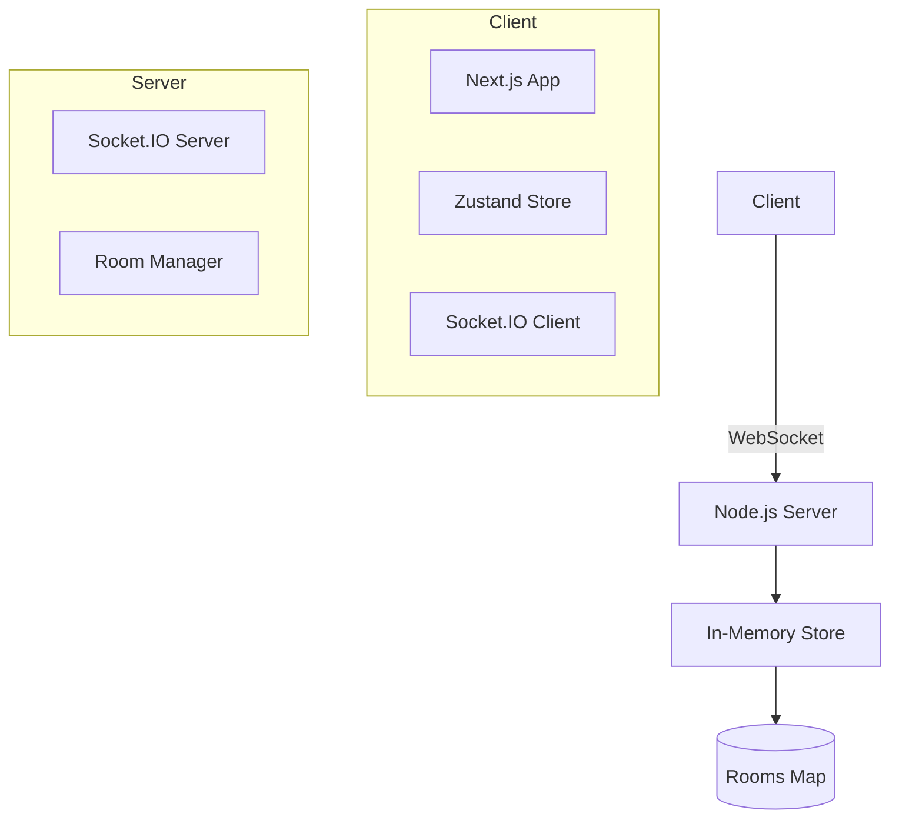
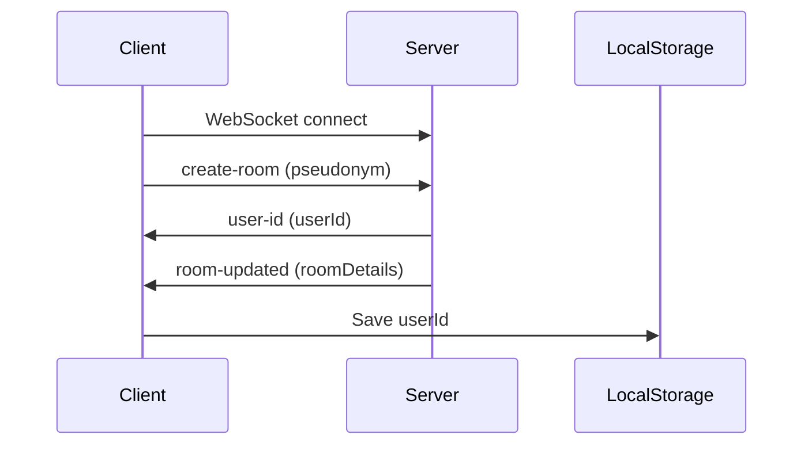
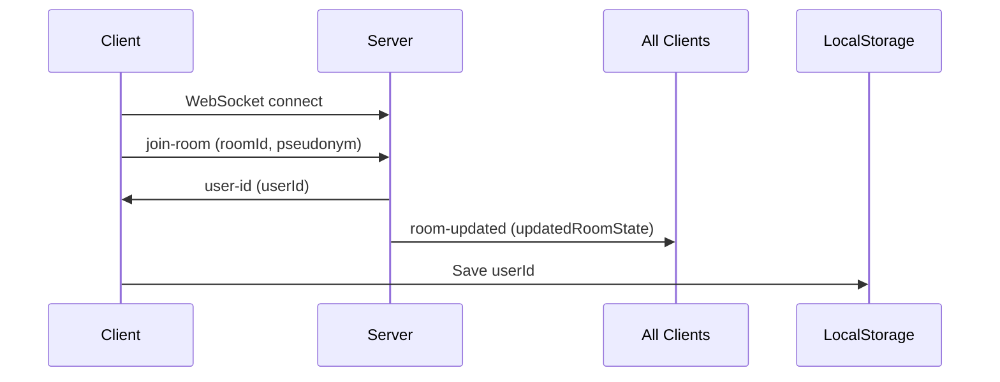
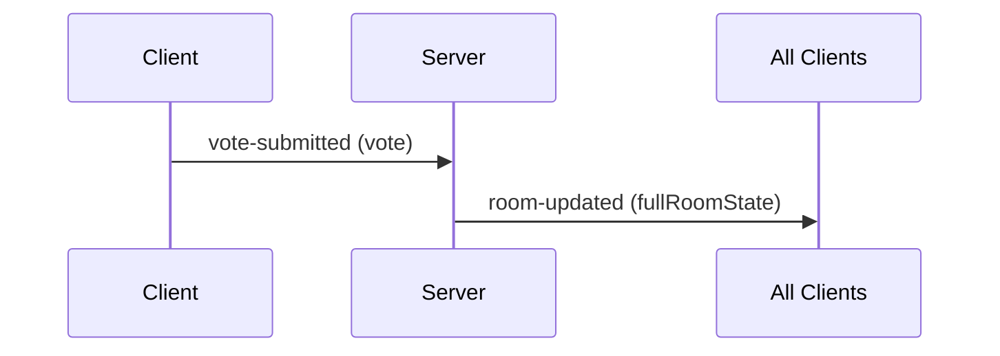
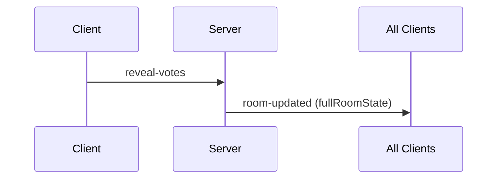

# System Patterns

## Architecture Overview

## Key Data Flows

1. **Room Creation**

2. **Room Joining** 

3. **Voting Process**

4. **Results Reveal**

5. **New Voting Session**

6. **State Synchronization**
- Single 'room-updated' event pattern
- Contains complete room state (participants, votes, revealed status)
- Reduces client-side state management complexity

## Room Management
- 6-character alphanumeric room codes
- Auto-cleanup after 24h inactivity
- Max 25 participants per room (configurable)

## Error Handling
- Room not found → 404 + redirect
- Duplicate pseudonym → 409 + prompt
- WebSocket disconnect → auto-reconnect
